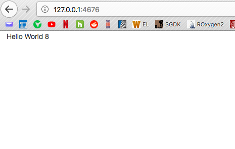
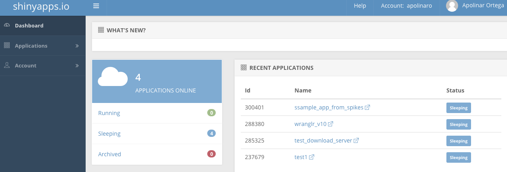
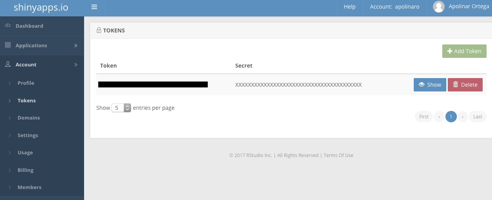
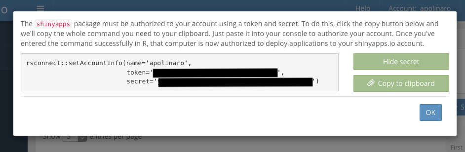
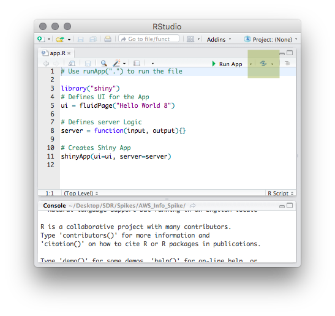
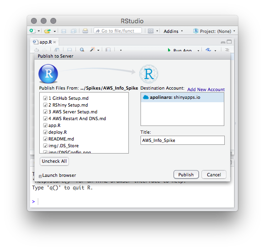

# Step 2: RShiny Setup
The purpose of this guide is to get a Hello World RShiny Application running on your local machine.

## RShiny Setup
At this point you already have R installed. Run the following in your R Console:

	install.packages("shiny")

## Running The App
Once installed, run the app.R file located here or the following command(s):

	library(shiny)
	runApp("app.R")

The app should output something similar to the following:
>Listening on http://127.0.0.1:4676

Copy the address outputted by your app onto your browser and a "Hello World" message should appear:

## Deploying A Project To ShinyApps.IO (Optional)
This part of the guide is meant to host the app within ShinyApps.io.

[Create a ShinyApps.io Account](https://www.shinyapps.io/) and log in. You should see a UI that looks somehting like the following:

Then navigate to Account > Tokens:

If you do not have a token, then you would need to create one. Once you have one, click on the "Show" button. A new menu should display. Click on the "Show Secret Button". Then copy the entire code onto your R console:

Your ShinyApps IO account is now connected to your computer. Now you can deploy your app onto the ShinyApps IO server with the following script:

	library(shiny)
	library(rsconnect)
	deployApp(appDir=".", appName="sample_app_name", contentCategory="application", lint=T, launch.browser=T, upload=T)

appName could be replaced with any app variable you wish to use. This script is located in deploy.R in this directory.

To deploy it using RStudio, simply click the button on the top right, which will then bring up a publish menu:

Once you deployed these apps, they are listed on the menu after logging into ShinyApps IO.
