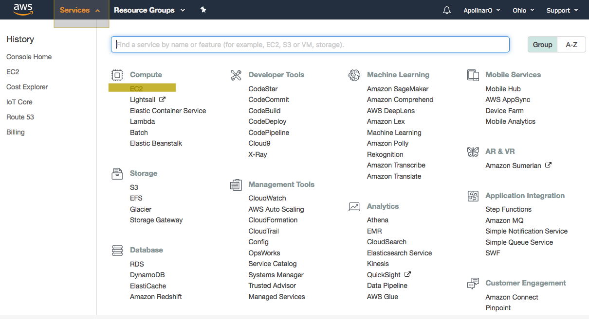
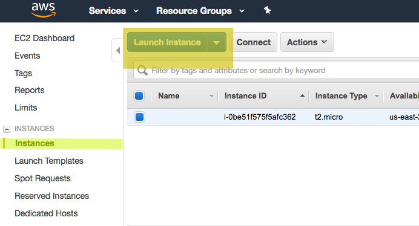
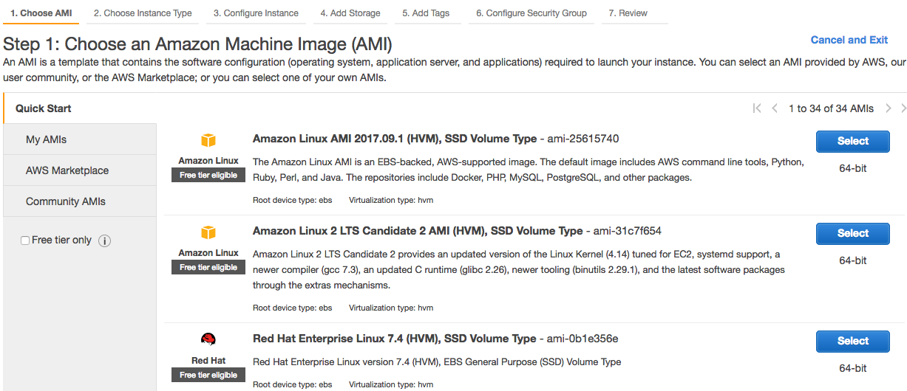
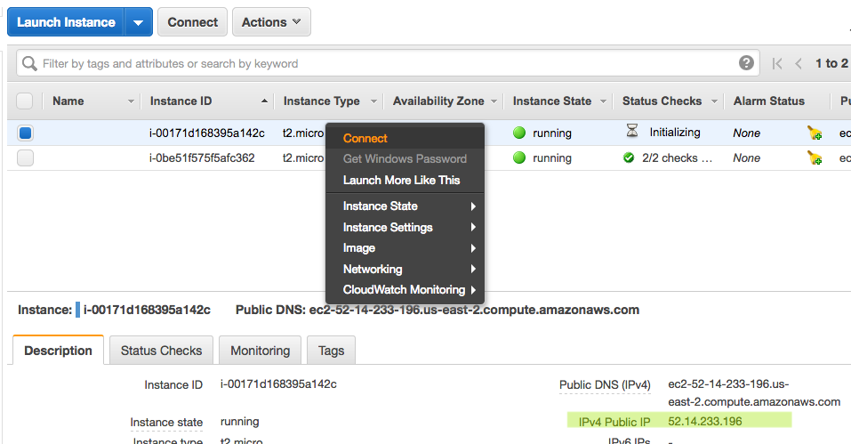
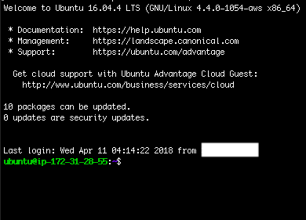
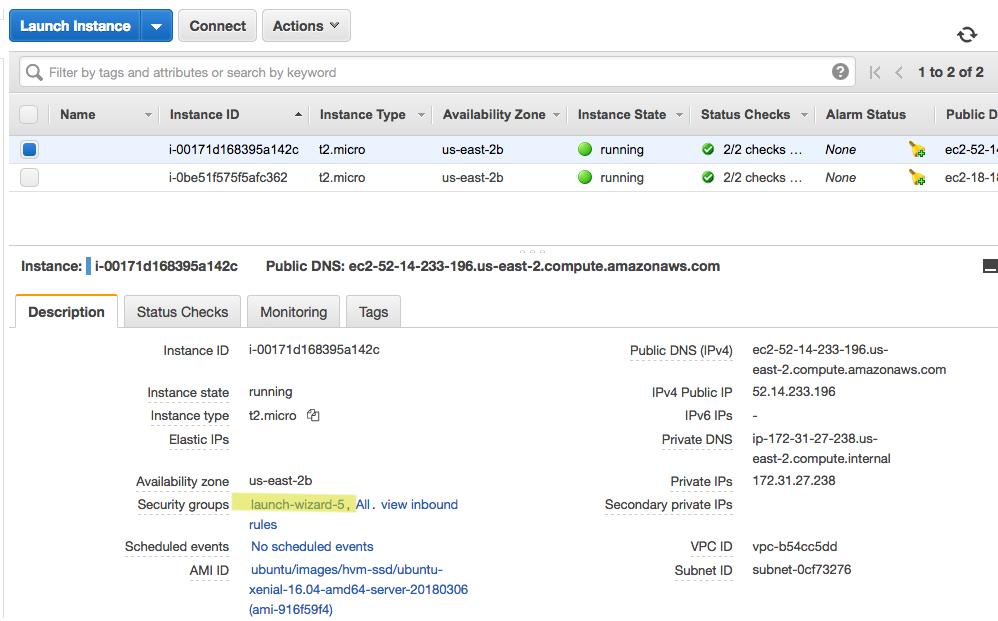
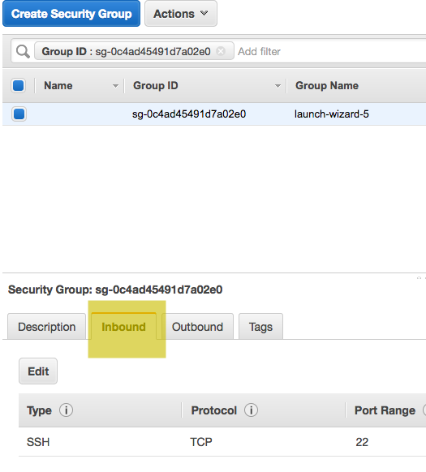

# Step 3: AWS Server Setup & Shiny Server Configuration
The purpose of this guide is to setup an AWS Server from the ground up and to setup hosting for an RShiny Application.

## Setting Up AWS Server
You first need to [create an Amazon Web Services account](https://aws.amazon.com/console/). Once logged in, navigate to the EC2:

Navigate to instances and click on the "Launch Instance" button and **then select Ubuntu from the given menu**:

Select the Ubuntu distribution from the given menu:

Select the t2.micro instance, which is free tier available. Then launch. When prompted to select a key pair, choose to create a new pair and give it a name. Download it.

This key pair is used to verify your identity when connecting to the server. **Keep it somewhere safe. DO NOT leave in the same directory as a git project. DO NOT delete or lose it**.

Navigate back to instances. Right click the instance and select connect. When you do this, you would like to run the commands on Bash or if on Windows, PuTTY:

Also take note of what your IPv4 address located on the bottom right corner of the screen. Your server is now up and running!

You know that you're connected to the server when you see the following screen:

## Setting Up Shiny Server
You want to have the latest R Version available. For this step, make sure that you are connected to the server. According to [this source](https://www.digitalocean.com/community/tutorials/how-to-install-r-on-ubuntu-16-04-2), you would want to enter the following onto the console:

	sudo apt-key adv --keyserver keyserver.ubuntu.com --recv-keys E298A3A825C0D65DFD57CBB651716619E084DAB9
	sudo add-apt-repository 'deb [arch=amd64,i386] https://cran.rstudio.com/bin/linux/ubuntu xenial/'
	sudo apt-get update
	sudo apt-get install r-base

Test that it works by running the following:

	sudo -i R

Run the following package installs:

	install.packages("shiny")
	install.packages("rsconnect")
	install.packages("rmarkdown")
	install.packages("Hmisc")
	install.packages("SASxport")
	install.packages("DT")

Exit the R session by running the q() command.

According to [this source](https://www.rstudio.com/products/shiny/download-server/), run the following commands to install Shiny Server itself:

	sudo apt-get install gdebi-core
	wget https://download3.rstudio.org/ubuntu-12.04/x86_64/shiny-server-1.5.6.875-amd64.deb
	sudo gdebi shiny-server-1.5.6.875-amd64.deb

Verify that it the server items have been installed by looking into the /opt/ directory:

	ls /opt/shiny-server/

According to [this source](https://www.r-bloggers.com/installing-rstudio-shiny-server-on-aws/), run the following to get a starter app running:

	sudo /opt/shiny-server/bin/deploy-example default

If not a valid command, then repeat the previous steps with wget and gdebi, but with a more updated Shiny Version. Now you need to allow the instance to connect to sources outside of the SSH. Select the ECS instance. On the bottom menu, select the "launch-wizard" link for "Security Groups":

Then select the "Inbound" tab a the bottom:

Select the edit tab and add a new rule like so:

Once installed, run the following:

	cat /etc/shiny-server/shiny-server.conf

Take note of the number after listen. That is the port number. Go to your web browser and enter "ip:port" using the IPv4 noted earlier and this port number. It should look something like:
>http://52.14.233.196:3838/

In order to allow connections from any port, specify port 80 when editing the config file:

	sudo nano /etc/shiny-server/shiny-server.conf 

Once you restart the server, you can simply type your IP address to access the welcome page from the browser.

## Setup The Project
cd into the ~ directory. Then clone the git repo:

	git clone https://github.com/apolinaro/sdr

Create a symlink leading from the server to the project:

	sudo ln -s ~/sdr/Source/wranglR_v.0.3/ /srv/shiny-server/WranglR

When updating a symlink, use -sf instead of -s.

You can now go tou your browser go to your new app, by adding "/WranglR/" to the end of your web address, which looks something like:
>>http://52.14.233.196:3838/WranglR/
