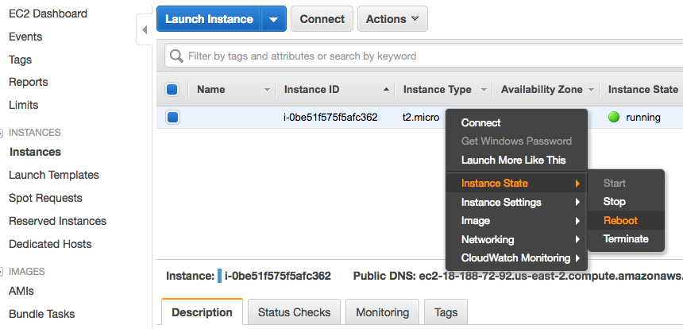
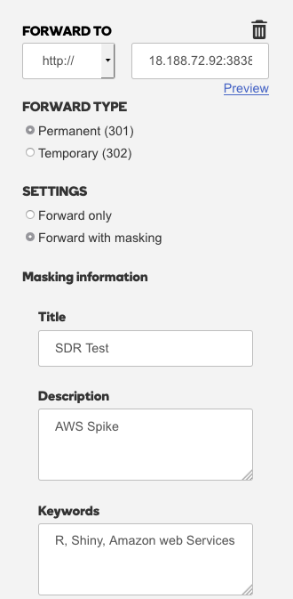

# Step 4: AWS Server Maintenance & DNS Setup
The purpose of this guide is to walk you through the steps of maintaining an AWS server and setting up a DNS for the app.

## Maintain the server

## Restart The Server
You can either reboot the server using the terminal or through AWS itself.

To reboot from the terminal, when logged into the server, enter the following:

	sudo reboot

From AWS, navigate navigate to EC2. Go to where AWS lists instances and right click the server instance. Select "Reboot".

## Setting Up A Domain Name (Optional)
Setting up a domain name is very simple. All it involves is buying a spot in a Domain Name Server (DNS) and giving it an IP adress to run on. Some of the biggest DNS vendors includes Amazon and GoDaddy.

Once you bought your DNS, setup its configuration similar to the one below:

When restarting your AWS server, be sure to update the Forward To field to your current IP and the port number.
